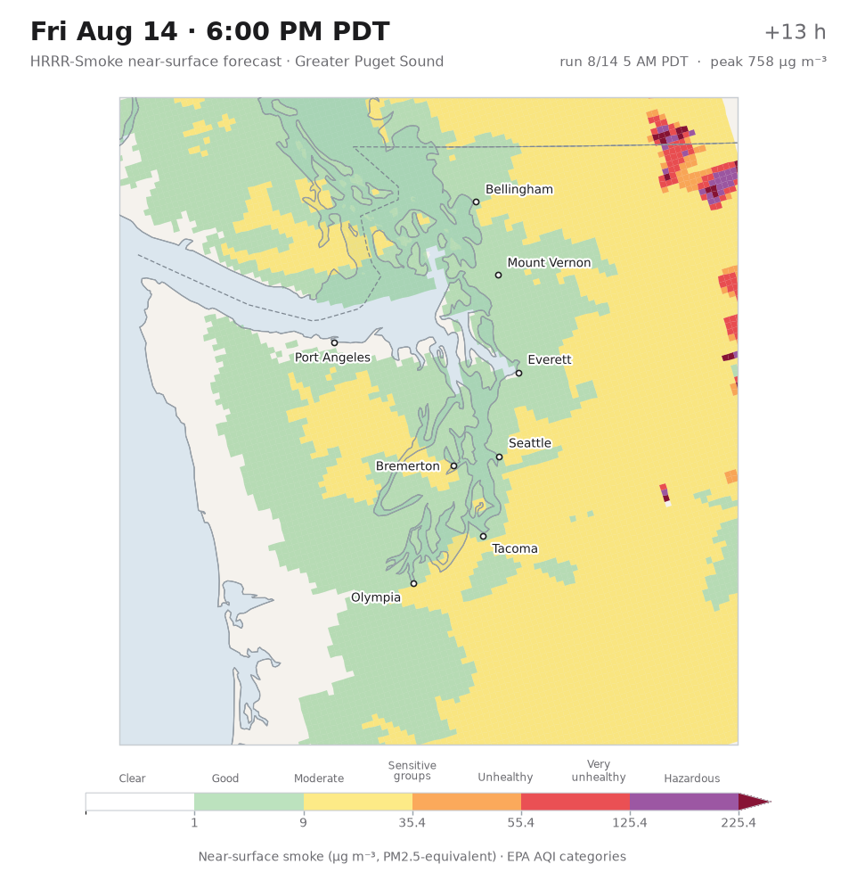

# hrrr_bot

Scrapes NOAA's **HRRR-Smoke** near-surface smoke forecast and turns it into a
short animation over the greater Puget Sound, labelled in local Pacific time.



## What it pulls

| | |
|---|---|
| Model | HRRR (High-Resolution Rapid Refresh), 3 km CONUS grid |
| Field | `MASSDEN` at `8 m above ground` — near-surface smoke, a PM2.5-equivalent mass concentration |
| Source | `noaa-hrrr-bdp-pds` on S3 (NOAA Big Data Program), surface files `hrrr.tHHz.wrfsfcfFF.grib2` |
| Units | GRIB stores kg m⁻³; everything here is converted to µg m⁻³ |

Each surface file is ~130 MB, but the smoke record is ~800 KB of it. The
scraper reads the file's `.idx` sidecar to find that record's byte offsets and
issues an HTTP range request for just those bytes, so a full 24-hour animation
moves about 20 MB instead of 3 GB.

## Install

```bash
python3 -m venv .venv
.venv/bin/pip install -r requirements.txt
```

`cfgrib`/`eccodes` decode the GRIB2 records and `cartopy` draws the coastline.
Cartopy downloads its Natural Earth shapefiles the first time it runs and
caches them afterwards, so the first frame is slower than the rest.

## Use

```bash
# Latest available run, next 24 hours over Puget Sound
.venv/bin/python -m hrrr_smoke

# Two-day outlook from a specific run, one frame per 3 hours
.venv/bin/python -m hrrr_smoke --cycle 2026080612 --hours 48 --step 3

# Wider view that catches smoke before it arrives
.venv/bin/python -m hrrr_smoke --domain cascadia --hours 36 --fps 6
```

Output lands in `out/`:

```
out/hrrr_smoke_puget_20260806_t15z.gif       the animation
out/frames_20260806_t15z_puget/f000.png ...  the individual frames
data/grib/smoke_20260806_t15z_f00.grib2 ...  cached records, reused on re-runs
```

An MP4 is written alongside the GIF when `ffmpeg` is on `PATH`; without it you
just get the GIF.

`out/` and `data/` are ignored by git — they are scratch. Animations worth
keeping get copied into `runs/`, which **is** committed, so the archive
survives across machines and sessions:

```
runs/hrrr_smoke_puget_20260806_t16z.gif
runs/hrrr_smoke_puget_20260806_t16z.mp4   (only where ffmpeg exists)
```

`--archive` copies **every** animation it produced, so on the GitHub runner —
which has ffmpeg — both the GIF and the MP4 are committed. The MP4 is roughly
half the size for the same frames; if the archive ever needs slimming, dropping
the GIF and keeping the MP4 is the cheapest win.

The filename already carries the date and cycle, so re-running the same cycle
overwrites its own file and a new cycle adds one.

Size scales with frame count: 18 hours hourly is ~1.2 MB of GIF, 48 hours
hourly is ~3.3 MB. `--step 2` halves both and is still perfectly readable for
smoke transport. Git history is not reclaimable, so this is worth watching over
a full smoke season.

The run also prints when each labelled city peaks:

```
Peak near-surface smoke by city (µg m⁻³):
  Seattle          12.0   at Thu 8 AM PDT
  Tacoma           16.3   at Thu 1 PM PDT
  ...
```

### Options

| Flag | Default | Notes |
|---|---|---|
| `--domain` | `puget` | `puget` or `cascadia` |
| `--cycle` | latest | HRRR run as `YYYYMMDDHH` **in UTC** |
| `--start` / `--hours` / `--step` | `0` / `24` / `1` | forecast-hour range and stride |
| `--fps` | `4` | animation speed |
| `--palette` | `aqi` | `aqi` health categories, or `mono` single-hue magnitude |
| `--tz` | `America/Los_Angeles` | any IANA zone |
| `--dpi` | `130` | frame resolution |
| `--force` | off | re-download instead of using the cache |
| `--no-mp4` | off | GIF only |
| `--archive DIR` | off | also copy the finished animation into `DIR` |
| `--gate` | off | skip rendering on clean days — see below |

## The gate

Rendering every day would fill `runs/` with animations of clean air. `--gate`
renders only when a reference city has actually seen, or is forecast to see,
smoke at or above an AQI category:

```bash
python -m hrrr_smoke --gate --gate-city Seattle --gate-threshold moderate
```

The window is **the current or previous local day** — yesterday 00:00 through
tonight 23:59. Because a forecast run cannot reach backwards, the hours already
past are read from each hour's own analysis (`f00` of the cycle initialised at
that hour) and the rest of today comes from the current run's forecast. That
costs roughly 48 extra range requests, about 40 MB.

When the gate does not trip, the command logs why and exits 0 — a clean day is
a success, not a failure.

| Gate flag | Default | Notes |
|---|---|---|
| `--gate-city` | `Seattle` | any city labelled on the domain |
| `--gate-threshold` | `moderate` | `good`, `moderate`, `sensitive`, `unhealthy`, `very-unhealthy`, `hazardous` |
| `--gate-days` | `1` | local days of history (`1` = yesterday and today, `0` = today only) |
| `--gate-step` | `1` | hours between historical samples |

## Scheduled runs

`.github/workflows/smoke.yml` runs the gated pipeline daily at **14:30 UTC**
(7:30 AM PDT / 6:30 AM PST) with `--extended --hours 48`, and commits any
animation to `runs/`.

That time is chosen off the cycle schedule rather than the clock: the 12Z long
run finishes about 13:47Z, so 14:30 leaves ~40 minutes of margin. GitHub's cron
often fires late, which is only ever safer here — `--extended` holds out for a
cycle that has published all 48 hours, so a late run still gets a complete
forecast instead of a half-written one.

To follow every long cycle instead of one a day, add the other three:

```yaml
- cron: "30 2,8,14,20 * * *"   # 00Z, 06Z, 12Z and 18Z runs
```

The runner has `ffmpeg`, so scheduled runs commit an MP4 into `runs/` alongside
the GIF, and upload both as a workflow artifact.

Use **Run workflow** to trigger it by hand; `force` renders even on a clean day,
`threshold` overrides the category, and `step` trades frames for file size.

Two things worth knowing:

- GitHub only runs `schedule` triggers from the **default branch**. This
  repository's default is `main`, so the workflow is live there — a copy of it
  on any other branch does nothing.
- Scheduled workflows are auto-disabled after 60 days of repository inactivity.
  Whether the workflow's own commits reset that clock is not something we have
  confirmed, so check in occasionally if the archive matters.

Observed cron drift has run 26–58 minutes late, which is why the schedule is set
off the cycle completion time with margin rather than at the hour.

## A note on "Pacific Standard Time"

The default `America/Los_Angeles` gives **local** Pacific time — PST (UTC−8) in
winter and PDT (UTC−7) during daylight saving, which is what a clock in Seattle
reads. Frames are labelled with whichever is in effect, so a summer animation
says `PDT`. If you specifically want fixed UTC−8 year-round, pass
`--tz Etc/GMT+8` (the sign is inverted in POSIX-style zone names — `GMT+8` is
UTC−8).

## Which runs have what

HRRR runs every hour, but the runs are not all the same length:

| Cycles | Forecast length | Complete by |
|---|---|---|
| `00/06/12/18Z` | **48 hours** | cycle + ~1.8 h |
| every other hour | 18 hours | cycle + ~1.4 h |

`--hours` is clamped to whatever the chosen cycle supports, so asking for 48
hours from a 15Z run silently gives you 18.

`--extended` restricts the search to the four long cycles:

```bash
python -m hrrr_smoke --extended --hours 48
```

Because asking for the extended cycles is really asking for their length, this
also holds out for a run that has published all the hours requested. If the
newest long cycle is still integrating, the search falls back to the previous
one rather than animating a half-written forecast — at 13:24Z the 12Z run has
only reached f24, so `--extended --hours 48` returns 06Z with its full f00–f48.

NCEP uploads files as the model integrates, so the newest cycle on S3 is
usually incomplete. By default the scraper walks back from the current hour and
takes the newest run that has published at least 12 forecast hours, rather than
building an animation out of the three frames that happen to exist yet. A
forecast hour only counts as available once **both** the GRIB file and its
`.idx` are present — without the index there is no way to range-request the
record.

## Reading the map

Colours are the EPA's PM2.5 AQI categories (2024 breakpoints), so a colour maps
to a health category rather than an arbitrary scale. Every band is named in the
legend, so the map is not readable by colour alone. Below 1 µg m⁻³ the overlay
is fully transparent and the basemap shows through — clean air recedes instead
of painting the whole region green.

| µg m⁻³ | Category |
|---|---|
| < 1 | Clear |
| 1 – 9 | Good |
| 9 – 35.4 | Moderate |
| 35.4 – 55.4 | Unhealthy for sensitive groups |
| 55.4 – 125.4 | Unhealthy |
| 125.4 – 225.4 | Very unhealthy |
| > 225.4 | Hazardous |

HRRR-Smoke is a forecast of smoke transported from detected fires; it is not a
measurement, and it does not include non-smoke PM2.5. For observations, see
[AirNow](https://www.airnow.gov) or [WA Ecology](https://enviwa.ecology.wa.gov).

## Tests

```bash
.venv/bin/pip install pytest
.venv/bin/python -m pytest tests -q
```

The suite covers cycle selection, `.idx` byte-range parsing, grid subsetting
and the colour bands; it stubs out S3 so it runs offline.

## Layout

```
hrrr_smoke/
  catalog.py   which cycle exists, which forecast hours it published
  fetch.py     .idx parsing + range requests + on-disk cache
  grid.py      GRIB decode, lat/lon clip to the domain
  render.py    per-frame map drawing
  animate.py   frames -> GIF / MP4
  cli.py       argument handling
  config.py    domains, cities, palettes
```
